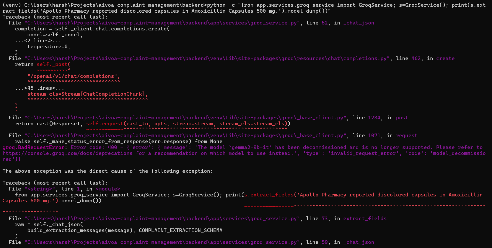
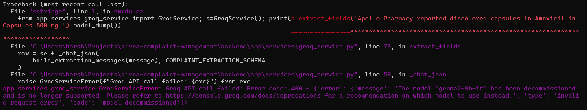
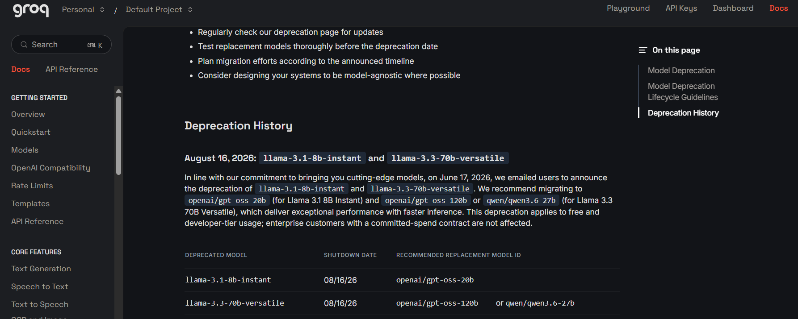
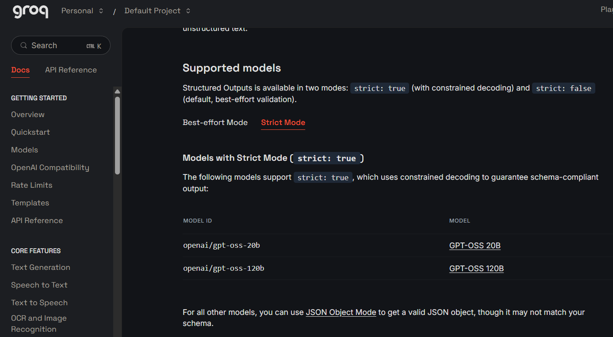

# AIVOA AI-Powered Customer Complaint Management System

## Overview
This project is an AI-powered customer complaint management system tailored for pharmaceutical manufacturing Quality Management Systems (QMS). It features a two-panel UI where the left panel displays the AI-controlled complaint form and risk assessment, and the right panel hosts the AIVOA Copilot AI Assistant.

## Local Development Setup

### Prerequisites
- Python 3.10+
- Node.js 18+

### Backend Setup
1. Navigate to the backend directory: `cd backend`
2. Create and activate virtual environment: `python -m venv venv && source venv/bin/activate`
3. Install dependencies: `pip install -r requirements.txt`
4. Setup env: `cp .env.example .env`
5. Run server: `uvicorn app.main:app --reload --port 8000`

### Frontend Setup
1. Navigate to the frontend directory: `cd frontend`
2. Install dependencies: `npm install`
3. Setup env: `cp .env.example .env`
4. Run server: `npm run dev`

## LLM Model Compatibility & Migration Decision

### Assignment Requirement

The original assignment specifies **Groq** as the LLM provider, with:

- `gemma2-9b-it` as the specifically requested model.
- `llama-3.3-70b-versatile` as an alternative that may be considered for additional context.

AIVOA continues to use **Groq as the required LLM provider**. However, during implementation, the model was migrated to:

`openai/gpt-oss-120b`

This change was necessary because of changes in Groq's currently supported model catalog and the structured-output requirements of AIVOA.

---

### 1. Why `gemma2-9b-it` Could Not Be Used

The assignment-specified `gemma2-9b-it` model was tested directly against the current Groq API.

The request was rejected with:

> `The model 'gemma2-9b-it' has been decommissioned and is no longer supported.`

Groq returned the error code:

`model_decommissioned`

#### Live API Verification

The following screenshots show the actual API verification performed during development:





This confirms that retaining `gemma2-9b-it` would make the AI functionality non-operational with the current Groq API.

Official reference: [Groq Model Deprecations](https://console.groq.com/docs/deprecations)

---

### 2. Why `llama-3.3-70b-versatile` Was Not Selected

The assignment also permits considering `llama-3.3-70b-versatile`.

Although this model may still be available in some Groq environments at the time of development, Groq has officially announced its deprecation for applicable Free and Developer-tier usage, with a scheduled shutdown date of **August 16, 2026**.

Groq's deprecation documentation recommends migrating from `llama-3.3-70b-versatile` to models including:

- `openai/gpt-oss-120b`
- `qwen/qwen3.6-27b`

#### Official Deprecation Evidence



Choosing `llama-3.3-70b-versatile` for a new implementation would therefore introduce a known near-term migration requirement.

Official reference: [Groq Model Deprecations](https://console.groq.com/docs/deprecations)

---

### 3. Why `openai/gpt-oss-120b` Was Selected

`openai/gpt-oss-120b` was selected as the replacement model because it provides both current Groq support and capabilities directly relevant to AIVOA's architecture.

AIVOA does not use the LLM only for conversational text generation. It converts unstructured pharmaceutical complaint descriptions into strongly typed application data.

For example:

| Natural-language input | Required structured value |
| --- | --- |
| `"three bottles"` | `3` |
| `"48 capsules"` | `48` |
| `"18 April 2026"` | `"2026-04-18"` |
| `"several bottles"` | `null` when an exact quantity cannot be determined |

During development, prompt-only JSON generation produced values such as `"48 capsules"` for a field represented as a numeric `Decimal`, and human-readable date strings for fields represented as typed dates. These responses correctly failed Pydantic validation.

To strengthen the extraction boundary, AIVOA uses Groq **Structured Outputs with Strict Mode (`strict: true`)** where supported.

Groq documents `openai/gpt-oss-120b` as one of the models supporting Strict Mode. In this mode, constrained decoding is used to guarantee schema-compliant output.

#### Structured Output Support



Official reference: [Groq Structured Outputs](https://console.groq.com/docs/structured-outputs)

---

### 4. Resulting AI Processing Architecture

The resulting complaint-processing pipeline is:

```text
Natural-language complaint
        ↓
LangGraph orchestration
        ↓
Groq — openai/gpt-oss-120b
        ↓
Strict JSON Schema Structured Output
        ↓
Normalization / validation safety layer
        ↓
Pydantic domain models
        ↓
FastAPI
        ↓
Redux Toolkit
        ↓
React complaint form + AI risk assessment