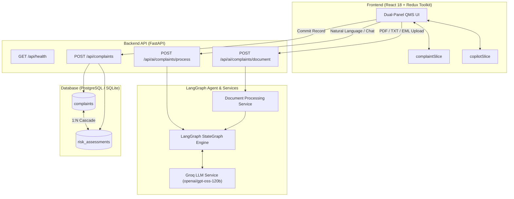
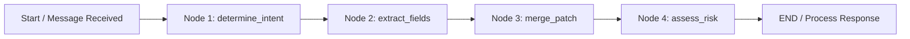
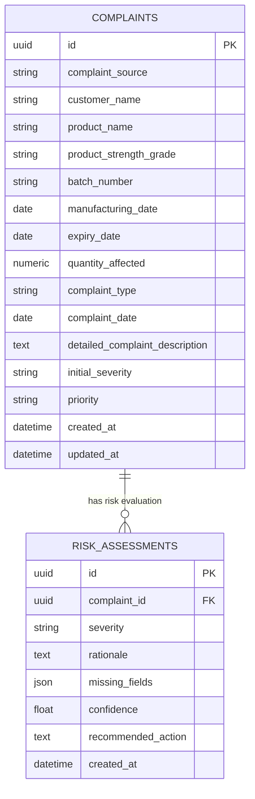

# AIVOA Complaint Management System


An enterprise-grade, AI-powered Quality Management System (QMS) customer complaint management platform specifically architected for pharmaceutical manufacturing. **AIVOA** bridges unstructured customer reports (emails, text messages, uploaded PDFs) and rigid regulatory QMS data requirements by orchestrating constrained LLM field extraction, multi-turn conversational updates, automated risk triaging, and ACID-compliant database persistence.

---

## 📌 Table of Contents

1. [Project Overview](#project-overview)
2. [Problem Statement & Motivation](#problem-statement--motivation)
3. [Key Features](#key-features)
4. [Technology Stack](#technology-stack)
5. [Architecture Overview](#architecture-overview)
6. [LangGraph Workflow](#langgraph-workflow)
7. [AI Pipelines](#ai-pipelines)
   - [Complaint Processing Pipeline](#complaint-processing-pipeline)
   - [Risk Assessment Pipeline](#risk-assessment-pipeline)
   - [Document Extraction Pipeline](#document-extraction-pipeline)
8. [LLM Model Compatibility & Migration Decision](#llm-model-compatibility--migration-decision)
9. [Application Screenshots](#application-screenshots)
10. [Sample Complaint PDF](#sample-complaint-pdf)
11. [API Endpoints](#api-endpoints)
12. [Database Schema Overview](#database-schema-overview)
13. [Project Structure](#project-structure)
14. [Installation & Setup](#installation--setup)
    - [Prerequisites](#prerequisites)
    - [Backend Setup](#backend-setup)
    - [Frontend Setup](#frontend-setup)
    - [Environment Variables](#environment-variables)
    - [Database Initialization](#database-initialization)
15. [Running the Application](#running-the-application)
16. [Running Automated Tests](#running-automated-tests)
17. [Known Limitations & Future Scope](#known-limitations--future-scope)
18. [Credits & License](#credits--license)

---

## 📖 Project Overview

In regulated pharmaceutical environments (GMP / 21 CFR Part 211 / EU Annex 11), complaint intake requires converting unstructured narratives (e.g., "Apollo Pharmacy received 3 bottles of discolored 500mg Amoxicillin with broken seals") into strongly typed, audit-ready data fields. Traditional manual data entry is slow, prone to human error, and delays critical risk triaging (such as recall evaluations).

**AIVOA** solves this challenge using a dual-panel web application:
- **Left Panel (Interactive QMS Record)**: Displays a real-time, read-only projection of structured complaint facts alongside a real-time AI Risk Assessment module.
- **Right Panel (AIVOA Copilot)**: An interactive AI Assistant capable of parsing natural language text, ingesting multi-format documents (`.pdf`, `.txt`, `.eml`), and guiding users through complete complaint capture.

---

## 🎯 Problem Statement & Motivation

### The Problem
1. **Unstructured Data Ingest**: Customer feedback arrives via informal channels (emails, scanned call logs, PDF attachments) containing mixed numeric and textual details.
2. **LLM Hallucination Risk**: Standard generative models frequently invent missing batch numbers, guess dates, or misformat quantities (e.g., returning `"three bottles"` instead of a numeric `3`).
3. **Destructive State Overwrites**: Multi-turn chat interfaces often overwrite existing verified fields when answering follow-up questions or processing minor corrections.
4. **Prompt Injection & Data Security**: Uploaded complaint PDFs can contain adversarial prompt injection text intended to override severity ratings or alter QA decisions.

### The Motivation
AIVOA addresses these failure modes by enforcing **strict token-level JSON schema constraints**, **deterministic non-destructive state merging**, **decoupled AI decision support**, and **security-hardened document parsing boundaries**.

---

## ✨ Key Features

- **Constrained Information Extraction**: Uses Groq Structured Outputs (`strict: true`) to guarantee JSON schema compliance at the model token decoding level.
- **Non-Destructive Patch Merging**: Multi-turn conversational edits augment existing fields without erasing prior facts unless explicitly overridden.
- **Automated QA Risk Triaging**: Real-time severity classification (Low, Medium, High, Critical) based on technical defect indicators, complete with rationale, confidence scores, and recommended actions.
- **Deterministic Field Completeness**: Computes missing fields strictly from application schema state, eliminating AI completeness hallucinations.
- **Secure Document Processing**: Validates PDF/TXT/EML uploads with 10MB file caps, 15,000 character limits, and prompt injection defense boundaries.
- **Visual Pulse Highlighting**: Animates updated form fields on the UI whenever new facts are extracted.
- **Transactional Database Persistence**: Single-commit transactional save linking `Complaint` and `RiskAssessment` records in PostgreSQL / SQLite.

---

## 🛠 Technology Stack

### Frontend
- **Framework**: React 18 (Vite build tool)
- **State Management**: Redux Toolkit (`complaintSlice`, `copilotSlice`)
- **Styling**: Vanilla CSS (Tailored dark QMS theme, glassmorphism, pulse animations)
- **HTTP Client**: Axios

### Backend
- **Framework**: FastAPI (Python 3.10+)
- **Agent Orchestration**: LangGraph (`StateGraph`, `ComplaintAgentState`)
- **LLM Provider**: Groq API (`openai/gpt-oss-120b` with Strict Mode Structured Outputs)
- **Data Validation**: Pydantic v2 & `pydantic-settings`
- **ORM & Database**: SQLAlchemy 2.0 with PostgreSQL (`psycopg3`) & SQLite (testing)
- **Document Processing**: PyPDF (`pypdf`)

---

## 🏗 Architecture Overview



For detailed component documentation, refer to [Architecture Documentation](file:///C:/Users/harsh/Projects/aivoa-complaint-management/docs/architecture.md).

---

## 🔄 LangGraph Workflow

AIVOA models complaint processing as a directed state graph managed by **LangGraph**. State passes sequentially through four specialized nodes:



1. **`determine_intent`**: Deterministically inspects `current_complaint` to label input as `'create'` (initial intake) or `'update'` (conversational refinement).
2. **`extract_fields`**: Sends input text to Groq API using `COMPLAINT_EXTRACTION_SCHEMA` in strict mode to extract source-supported fields.
3. **`merge_patch`**: Non-destructively merges extracted fields into existing state. Nulls in the patch never overwrite existing non-null facts. Document uploads augment missing facts without overwriting pre-existing data.
4. **`assess_risk`**: Evaluates technical complaint facts to generate severity ratings, confidence scores, and recommended actions. Deterministically calculates `missing_fields`. Skips LLM calls on no-op conversational updates.

Detailed node execution rules can be found in [Workflow Documentation](file:///C:/Users/harsh/Projects/aivoa-complaint-management/docs/workflow.md).

---

## 🤖 AI Pipelines

### Complaint Processing Pipeline
- **Input**: Natural language chat message + current frontend complaint state.
- **Strict Decoding**: Enforces numbers for `quantity_affected` and ISO dates (`YYYY-MM-DD`) for date fields at the API boundary.
- **Normalization Safety Net**: Pydantic `@field_validator` functions handle word-to-number fallback (`"three"` -> `3`) and fuzzy date resolution while converting ambiguous quantities (`"several bottles"`) to `null`.

### Risk Assessment Pipeline
- **Decoupled Facts vs. Support**: Risk assessments are stored in a dedicated `RiskAssessment` table and rendered in a separate UI card.
- **Deterministic Completeness**: Completeness check evaluates `ComplaintBase` fields against `None`, ensuring 100% accurate missing field tracking.

### Document Extraction Pipeline
- **Supported File Types**: `.pdf`, `.txt`, `.eml`
- **Validation**: Enforces 10MB maximum size limit and 15,000 maximum character limit.
- **Prompt Injection Defense**: Encapsulates document content within explicit untrusted source boundaries (`--- BEGIN DOCUMENT CONTENT ---`). Embedded prompt override instructions are ignored by system instructions.

---

## ⚡ LLM Model Compatibility & Migration Decision

### Assignment Requirement vs. Live API Realities

The original project specification identified **Groq** as the required LLM provider with `gemma2-9b-it` as the default model and `llama-3.3-70b-versatile` as an alternative.

During implementation, the model was updated to:
**`openai/gpt-oss-120b`**

This decision was driven by two critical operational factors:

#### 1. Decommissioning of `gemma2-9b-it`
Direct verification against the Groq API confirmed that `gemma2-9b-it` has been officially decommissioned:
> `The model 'gemma2-9b-it' has been decommissioned and is no longer supported.` (Error code: `model_decommissioned`)


#### 2. Deprecation of `llama-3.3-70b-versatile`
Groq officially announced the upcoming shutdown of `llama-3.3-70b-versatile` for Developer tier usage (scheduled for August 16, 2026), recommending migration to `openai/gpt-oss-120b`.


#### 3. Selection of `openai/gpt-oss-120b`
`openai/gpt-oss-120b` fully supports Groq **Structured Outputs with Strict Mode (`strict: true`)**. This guarantees schema compliance at the token decoding stage, preventing malformed dates or non-numeric quantities from entering the Pydantic boundary.


---

## 🖼 Application Screenshots

The repository includes screenshot specification guides for showcase presentations. Refer to [Screenshot Guidelines](file:///C:/Users/harsh/Projects/aivoa-complaint-management/docs/screenshots.md) for full image metadata.

| View | Description | Recommended Reference |
| --- | --- | --- |
| **Initial Intake UI** | Dual-panel workspace with empty complaint form & copilot upload zone | [screenshots.md#1](file:///C:/Users/harsh/Projects/aivoa-complaint-management/docs/screenshots.md) |
| **Document Extraction** | PDF upload showing pulse highlights on extracted form fields | [screenshots.md#2](file:///C:/Users/harsh/Projects/aivoa-complaint-management/docs/screenshots.md) |
| **Risk Assessment** | Critical severity banner, rationale, and recommended actions | [screenshots.md#3](file:///C:/Users/harsh/Projects/aivoa-complaint-management/docs/screenshots.md) |
| **Database Persistence** | Saved banner with UUID confirmation after database commit | [screenshots.md#4](file:///C:/Users/harsh/Projects/aivoa-complaint-management/docs/screenshots.md) |

---

## 📄 Sample Complaint PDF

A pre-configured test PDF document is provided in the repository for demonstration and automated testing:

- **Location**: [`samples/metformin_complaint.pdf`](file:///C:/Users/harsh/Projects/aivoa-complaint-management/samples/metformin_complaint.pdf)
- **Contents**: A realistic quality complaint from "Metro General Hospital" regarding Metformin 500mg (Batch `MTF-2026-089`) reporting broken tablet seals and physical crumbling.

---

## 🔌 API Endpoints

| Method | Endpoint | Description |
| --- | --- | --- |
| `GET` | `/api/health` | Service health check and status verification. |
| `POST` | `/api/ai/complaints/process` | Processes a conversational message through LangGraph. |
| `POST` | `/api/ai/complaints/document` | Processes uploaded document binary (`.pdf`, `.txt`, `.eml`). |
| `POST` | `/api/complaints` | Persists verified complaint and risk assessment to database. |

For full request/response schemas and example payloads, see [API Documentation](file:///C:/Users/harsh/Projects/aivoa-complaint-management/docs/api.md).

---

## 🗄 Database Schema Overview

The system uses SQLAlchemy ORM mapping to PostgreSQL / SQLite:



Detailed database schema specs are in [Database Documentation](file:///C:/Users/harsh/Projects/aivoa-complaint-management/docs/database.md).

---

## 📂 Project Structure

```text
aivoa-complaint-management/
├── backend/
│   ├── app/
│   │   ├── agents/            # LangGraph agent graph, nodes, and state definitions
│   │   │   ├── graph.py
│   │   │   ├── nodes.py
│   │   │   └── state.py
│   │   ├── api/               # FastAPI routers (health, ai, complaints)
│   │   │   ├── ai.py
│   │   │   ├── complaints.py
│   │   │   └── health.py
│   │   ├── core/              # Configuration & Pydantic settings
│   │   │   └── config.py
│   │   ├── db/                # SQLAlchemy database connection & session setup
│   │   │   └── database.py
│   │   ├── models/            # SQLAlchemy ORM database models
│   │   │   ├── complaint.py
│   │   │   └── risk_assessment.py
│   │   ├── schemas/           # Pydantic validation & transfer schemas
│   │   │   ├── ai.py
│   │   │   ├── complaint.py
│   │   │   └── risk_assessment.py
│   │   └── services/          # Groq service, document extraction, prompts, schemas
│   │       ├── document_service.py
│   │       ├── groq_service.py
│   │       ├── prompts.py
│   │       └── schema_utils.py
│   ├── tests/                 # Comprehensive backend test suite (33 test cases)
│   │   └── test_complaints.py
│   ├── .env.example
│   ├── main.py
│   └── requirements.txt
├── docs/                      # Comprehensive technical & academic documentation
│   ├── api.md
│   ├── architecture.md
│   ├── database.md
│   ├── demo-script.md
│   ├── final-checklist.md
│   ├── report-outline.md
│   ├── screenshots.md
│   ├── workflow.md
│   └── images/                # Verification screenshots & evidence
├── frontend/
│   ├── src/
│   │   ├── app/               # Redux store configuration
│   │   ├── components/        # SVG icon library & reusable components
│   │   ├── features/          # Complaint form, risk assessment, and copilot modules
│   │   │   ├── complaint/
│   │   │   └── copilot/
│   │   ├── services/          # Axios API communication layer
│   │   ├── App.css
│   │   ├── App.jsx
│   │   └── main.jsx
│   ├── index.html
│   ├── package.json
│   └── vite.config.js
├── samples/                   # Sample test complaint files
│   └── metformin_complaint.pdf
└── README.md
```

---

## ⚙️ Installation & Setup

### Prerequisites
- **Python**: 3.10 or higher
- **Node.js**: 18.0 or higher
- **Groq API Key**: Obtainable from [console.groq.com](https://console.groq.com/)

### Backend Setup

1. **Navigate to backend directory**:
   ```bash
   cd backend
   ```

2. **Create and activate a virtual environment**:
   - **Linux/macOS**:
     ```bash
     python -m venv venv
     source venv/bin/activate
     ```
   - **Windows (PowerShell)**:
     ```powershell
     python -m venv venv
     .\venv\Scripts\Activate.ps1
     ```

3. **Install dependencies**:
   ```bash
   pip install -r requirements.txt
   ```

4. **Configure environment variables**:
   ```bash
   cp .env.example .env
   ```
   Edit `.env` and set your `GROQ_API_KEY`:
   ```env
   GROQ_API_KEY=gsk_your_actual_groq_api_key_here
   GROQ_MODEL=openai/gpt-oss-120b
   DATABASE_URL=sqlite:///./aivoa.db
   FRONTEND_ORIGIN=http://localhost:5173
   ```

### Frontend Setup

1. **Navigate to frontend directory**:
   ```bash
   cd ../frontend
   ```

2. **Install Node packages**:
   ```bash
   npm install
   ```

3. **Configure environment variables**:
   ```bash
   cp .env.example .env
   ```
   Ensure `.env` contains:
   ```env
   VITE_API_BASE_URL=http://localhost:8000
   ```

### Database Initialization

To create database tables locally:
```python
from app.db.database import init_db
init_db()
```
*(Note: SQLite tables will automatically be created on first persistence request if using default SQLite URL, or PostgreSQL tables when pointing to a live database).*

---

## 🚀 Running the Application

1. **Start the Backend Server**:
   ```bash
   cd backend
   .\venv\Scripts\python -m uvicorn app.main:app --reload --port 8000
   ```
   The backend API will run at `http://localhost:8000` (Interactive Swagger docs at `http://localhost:8000/docs`).

2. **Start the Frontend Development Server**:
   ```bash
   cd frontend
   npm run dev
   ```
   The web application will open at `http://localhost:5173`.

---

## 🧪 Running Automated Tests

AIVOA includes a comprehensive test suite of 33 unit and integration tests covering extraction, normalization, merging, risk assessment, document validation, and database transactions.

Execute tests using Python's built-in `unittest` module:

```bash
cd backend
.\venv\Scripts\python -m unittest discover -s tests
```

Expected Output:
```text
----------------------------------------------------------------------
Ran 33 tests in 0.208s

OK
```

---

## ⚠️ Known Limitations & Future Scope

### Known Limitations
- **PDF Scans**: OCR is not built-in; PDFs must contain extractable text streams (non-rasterized).
- **Language Support**: Prompts are optimized for English pharmaceutical complaint narratives.
- **Concurrency**: State tracking relies on active frontend state passed with each request (stateless REST design).

### Future Scope
- **Multi-Tenant QA Roles**: Role-based access control (RBAC) for Investigators vs. QA Approvers.
- **CAPA Integration**: Direct export to enterprise QMS platforms (Veeva Vault QMS, TrackWise).
- **Tesseract OCR Integration**: Automatic OCR preprocessing for scanned physical letters and faxed complaints.

---

## 📜 Credits & License

- **Developed By**: Technical Lead & Release Engineering Team
- **Frameworks**: FastAPI, React, Redux Toolkit, LangGraph, Groq SDK