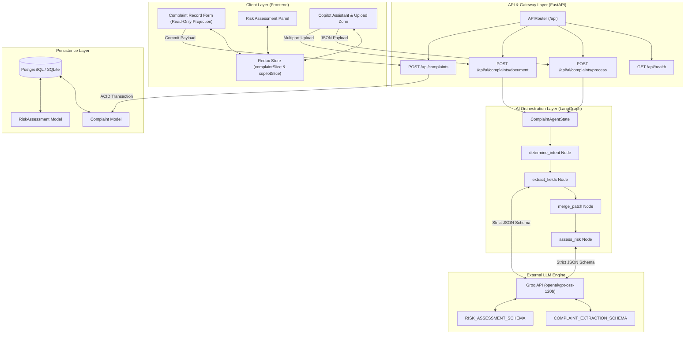
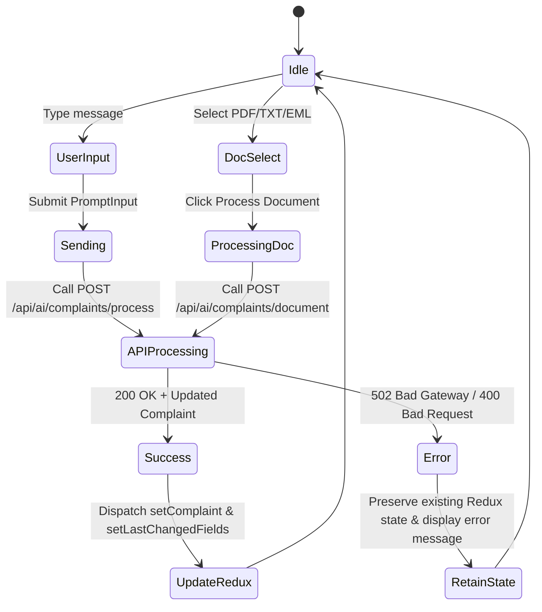
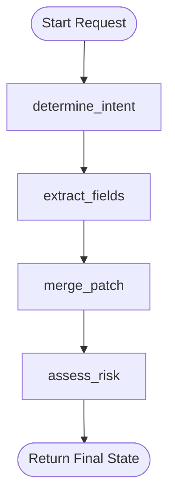
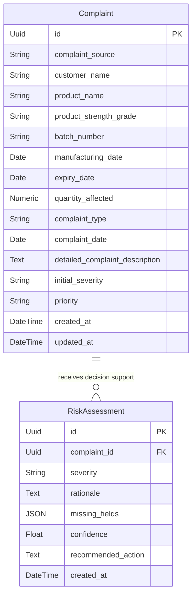
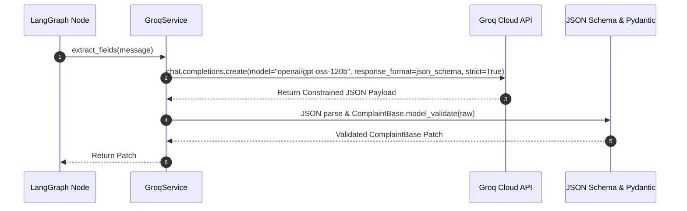
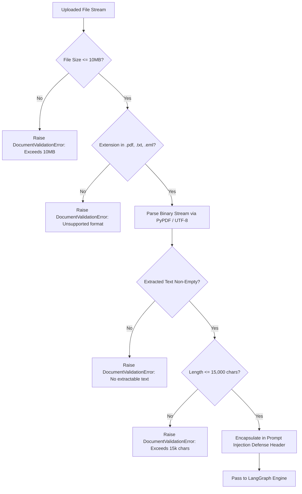
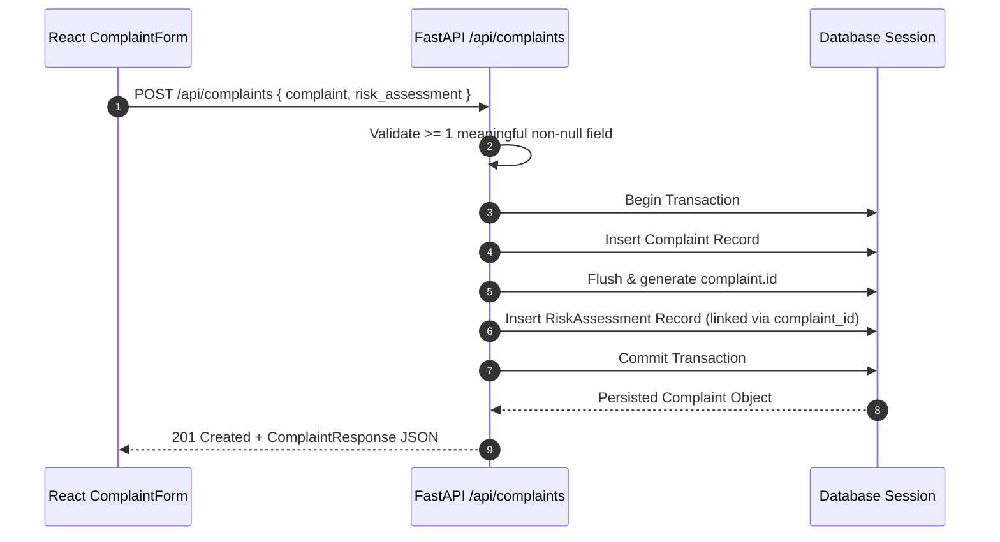

# AIVOA Architectural Documentation

## Executive Summary

**AIVOA (AI-Powered Quality Management System Complaint Assistant)** is an automated complaint processing application for pharmaceutical manufacturing. The architecture is engineered around the principle of **strict data integrity**, ensuring that AI capabilities provide structured data extraction, conversational updating, and risk-assessment decision support without ever introducing fabricated data, overwriting verified facts, or hallucinating schema values.

---

## 1. Overall System Architecture

The system follows a decoupled client-server architecture. The frontend is built as a single-page application (SPA) in React 18 with Redux Toolkit, offering a dual-panel interface. The backend is a stateless RESTful service powered by FastAPI, incorporating a **LangGraph** orchestration graph and a **Groq LLM Service** that enforces constrained decoding via JSON Schema.



---

## 2. Frontend Architecture

The frontend is implemented using React 18, Vite, and Redux Toolkit. It enforces a **dual-panel layout**:
- **Left Panel**: Consists of `ComplaintForm.jsx`, `TriageStatus.jsx`, and `RiskAssessment.jsx`. All inputs in `ComplaintForm` are marked as `readOnly` or `disabled` because the form acts as a pure projection of the AI-extracted state stored in Redux.
- **Right Panel**: Consists of `CopilotPanel.jsx`, `ChatMessage.jsx`, and `PromptInput.jsx`. This handles document file selection (`.pdf`, `.txt`, `.eml`), drag-and-drop intake, example prompt insertion, and chat history rendering.

### Redux State Slices
1. **`complaintSlice`**: Holds the current structured `complaint` object, `riskAssessment` object, `missingFields` array, and `lastChangedFields` array (which triggers visual pulse animations on updated form fields).
2. **`copilotSlice`**: Tracks chat `messages`, `uploadedDocument` metadata, `draftText`, `loading` boolean, and `error` state.



---

## 3. Backend Architecture

The backend is built with FastAPI, adhering to modular package boundaries:
- **`app/api/`**: REST routers defining request validation, status codes, and HTTP exception handling.
- **`app/agents/`**: LangGraph graph topology, node definitions, and state typed dicts.
- **`app/services/`**: Groq API communication, prompt template formatting, document parsing, and JSON schema definitions.
- **`app/models/`**: SQLAlchemy ORM entity classes.
- **`app/schemas/`**: Pydantic v2 data models, field validators, and normalization rules.
- **`app/db/`**: Engine instantiation, session management (`get_db`), and schema migration (`init_db`).

---

## 4. LangGraph Workflow Architecture

LangGraph orchestrates the processing graph via a `StateGraph(ComplaintAgentState)`. 

### Graph Topology


### Node Responsibilities & Rules
1. **`determine_intent`**: Deterministically inspects `current_complaint`. If any field is non-null, sets `intent = "update"`, otherwise `intent = "create"`.
2. **`extract_fields`**: Calls `GroqService.extract_fields` (or `extract_document_fields`). Captures any LLM or schema validation errors into `state["error"]`.
3. **`merge_patch`**: Performs non-destructive patch application:
   - **Conversational Edit Rule**: Extracted non-null values update existing values. Nulls in the patch are ignored.
   - **Document Intake Rule**: Extracted facts **augment** null fields but **cannot overwrite** pre-existing non-null facts.
   - Computes `changed_fields` containing strictly field names whose final value differs from pre-merge state.
4. **`assess_risk`**: Evaluates technical complaint facts. Skips LLM calls if `intent == "update"` and `len(changed_fields) == 0` (no-op optimization). Computes `missing_fields` deterministically.

---

## 5. Database Architecture

The persistence model separates extracted facts from AI decision support using two SQLAlchemy models:



### Key Data Integrity Rules
- Every field on `Complaint` is **nullable by design**. Unknown values are stored as `NULL` to eliminate unverified default values.
- `RiskAssessment` entries are linked via foreign key `complaint_id` with `cascade="all, delete-orphan"`.
- Transactions are committed atomically in `POST /api/complaints`.

---

## 6. Groq LLM Integration & Strict JSON Schemas

AIVOA utilizes Groq's API with model **`openai/gpt-oss-120b`**. To eliminate invalid types, the system bypasses free-form text output entirely and enforces **Structured Outputs** (`response_format={"type": "json_schema", "strict": True}`).



### Type Safeguards
- `quantity_affected`: Restricted to JSON type `["number", "null"]`. Spelled-out numbers (e.g., `"48 capsules"`) are converted to `48` via Pydantic validators, while indefinite amounts (`"several"`) map to `null`.
- Date fields (`manufacturing_date`, `expiry_date`, `complaint_date`): Constrained to ISO 8601 strings (`YYYY-MM-DD`). Incomplete date strings map strictly to `null`.

---

## 7. Document Processing Architecture

The `document_service.py` module handles document ingestion (`.pdf`, `.txt`, `.eml`):



### Prompt Injection Defense
Document text is wrapped in untrusted source boundaries:
```text
UNTRUSTED UPLOADED DOCUMENT SOURCE DATA:
--- BEGIN DOCUMENT CONTENT ---
<extracted document text>
--- END DOCUMENT CONTENT ---
```
System prompts explicitly mandate that any embedded directives inside the text must be treated solely as text data, preventing prompt injection attacks.

---

## 8. Persistence Architecture

When the user clicks **Save Complaint**, the frontend calls `POST /api/complaints` with the current Redux `complaint` and `riskAssessment` state.



If any error occurs during insertion, `db.rollback()` is invoked, guaranteeing zero partial persistence.
