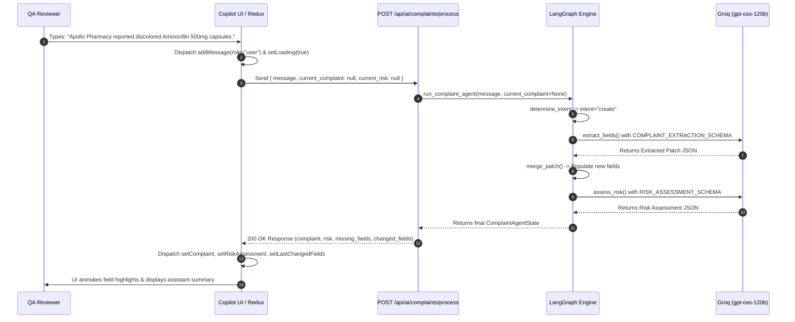
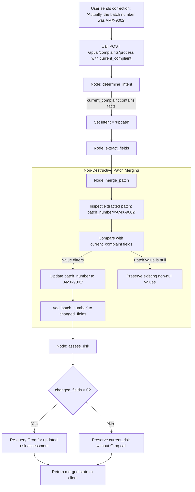
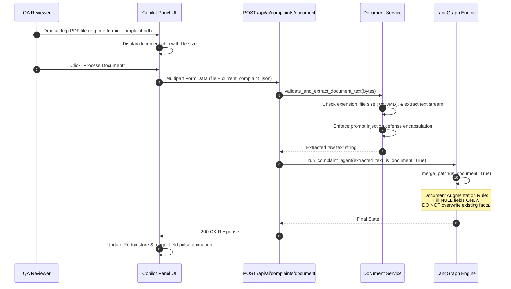
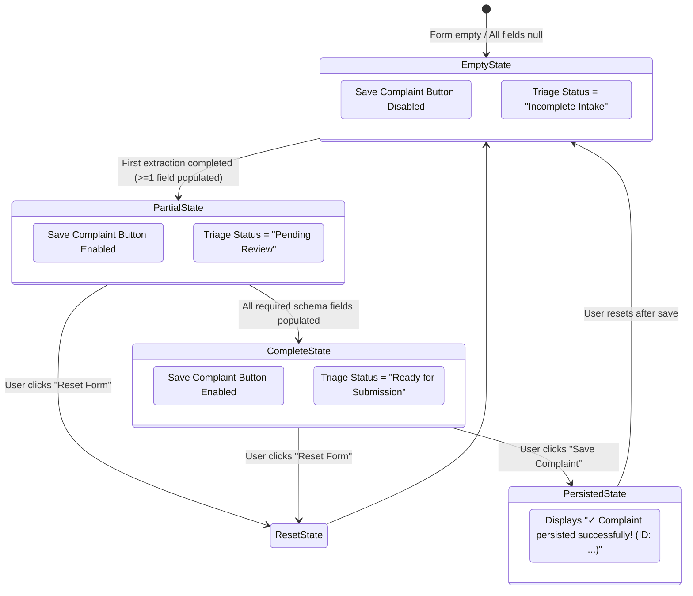
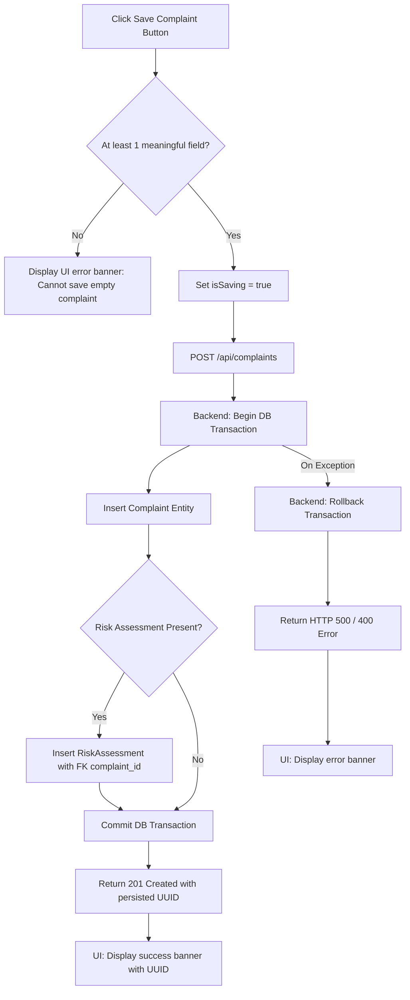

# AIVOA End-to-End Workflow Documentation

This document explains the end-to-end operational workflows and state transition models within the **AIVOA Complaint Management System**.

---

## Workflow Overview

AIVOA processes incoming complaints through five distinct workflows:
1. **Conversational Intake Workflow**
2. **Correction & Refinement Workflow**
3. **Document Upload & Processing Workflow**
4. **"Ready to Commit" Triage State Machine**
5. **ACID Transaction Persistence Workflow**

---

## 1. Conversational Intake Workflow

The conversational intake workflow allows users to type unstructured complaint details directly into the Copilot chat input.

---

## 2. Correction & Refinement Workflow

When an active complaint record exists on the screen, subsequent chat messages trigger the **Correction & Refinement Workflow**.

---

## 3. Document Upload Workflow

The Document Upload Workflow ingests `.pdf`, `.txt`, or `.eml` files without overwriting pre-existing complaint data.

---

## 4. "Ready to Commit" Triage State Machine

The frontend calculates form completeness and triage status dynamically via Redux state.

---

## 5. Persistence Workflow

When the QA Reviewer verifies the form data and clicks **Save Complaint**, the record is committed to the database.

